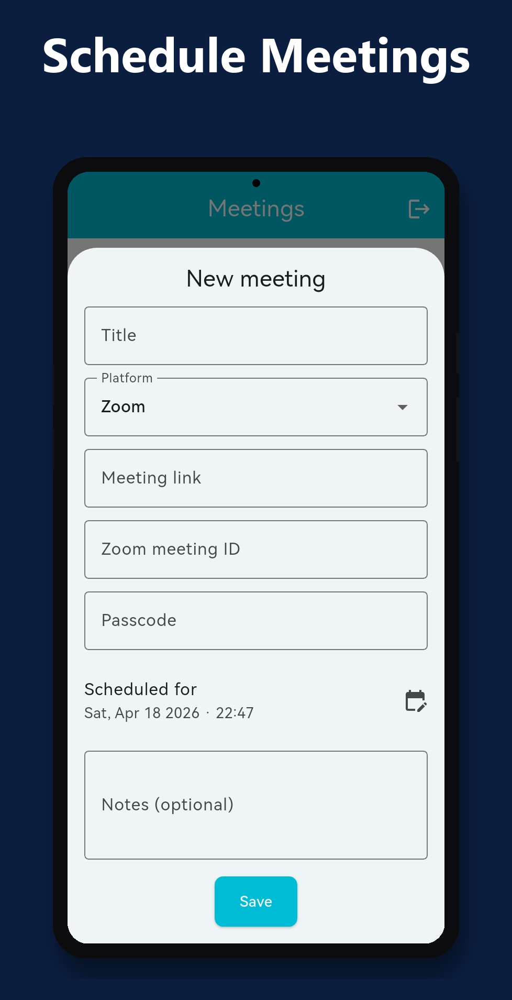
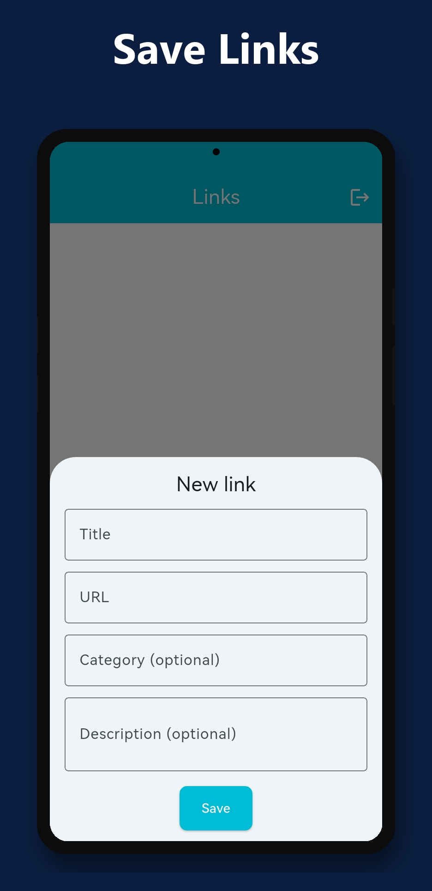
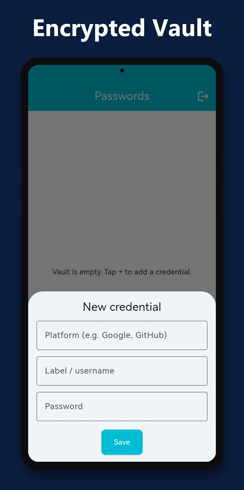
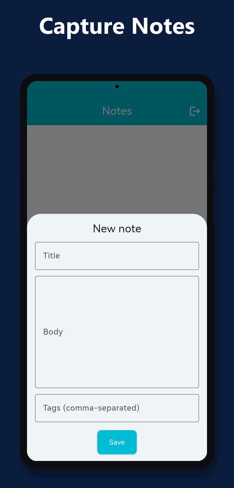
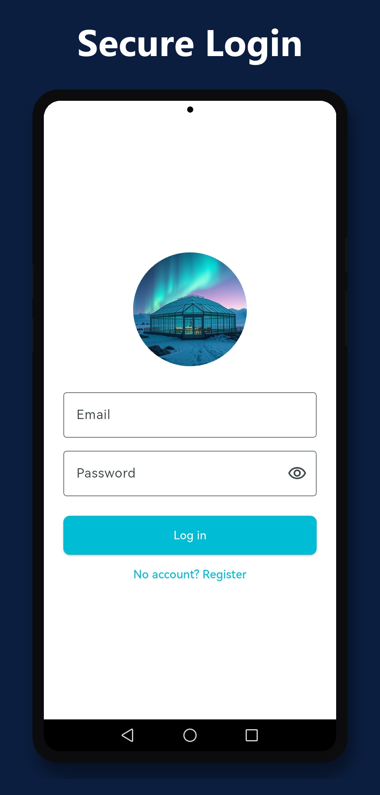
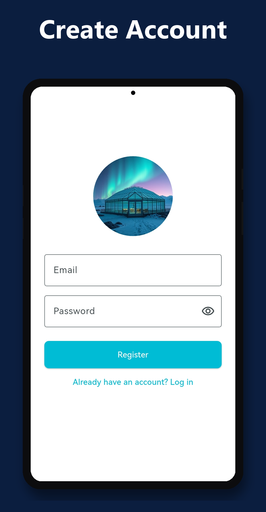

<h1 align="center">Deeks</h1>

<p align="center">
  <em>One place for the stuff you always forget.</em><br/>
  Meetings, links, passwords and notes — unified, private, fingerprint-gated.
</p>

<p align="center">
  
  
  
  
  
</p>

---

## 🧭 The problem

Personal digital scraps live in too many places. Meeting links rot in email. Useful URLs end up buried in three different bookmark folders, a Notes app, and a messenger thread. Passwords get reused across twenty sites because a real vault feels like overkill. And everyone has a camera roll full of screenshots of text they couldn't be bothered to retype — photos that are never searchable again.

The failure mode is always the same: **"I know I saved this somewhere, but I can't find it fast enough."**

So something important slips — a meeting is missed, a link is lost, a password is reset for the nth time, a note is rewritten from scratch because the photo is three weeks back in the gallery.

## 🎯 The solution

Deeks is a small, private utility belt for the four kinds of things people consistently lose track of. Each section targets a specific failure — one app, four screens, cross-device sync, strong local security where it matters.

| Section | What it solves |
|---|---|
| **Meetings** | Store Zoom / Google Meet / Microsoft Teams links with their ID, passcode and time. A **10-minute local notification** fires before the meeting — even with the app closed, even offline. |
| **Links** | Replaces the browser-bookmark folder you never open. Title, URL, category, description — searchable, synced. |
| **Passwords** | A proper vault. **End-to-end AES-256-GCM encryption** with a key derived from your master PIN on the device. The server stores ciphertext only — it is structurally incapable of reading your credentials. |
| **Notes** | Plain notes, plus **on-device Tesseract OCR**: point the camera (or pick from gallery), the text is extracted, and a searchable note is created for you. |

Tap the **Passwords** or **Notes** tab and the OS-native fingerprint prompt appears every single time — `BiometricPrompt` on Android, `LAContext` on iOS. The templates never leave the secure hardware chip; the app only ever gets a yes/no.

## 📱 Screenshots

<table>
  <tr>
    <td align="center"></td>
    <td align="center"></td>
    <td align="center"></td>
  </tr>
  <tr>
    <td align="center"></td>
    <td align="center"></td>
    <td align="center"></td>
  </tr>
</table>

## 🏗️ Architecture

Microservices — five independent NestJS services behind an nginx API gateway, each with its own Mongo database. Co-located on one EC2 instance via Docker Compose to stay inside AWS Free Tier; ready to split across hosts the day the app outgrows it.

```
                        ┌──────────────────────────────┐
                        │       Flutter client         │
                        │  (Android / iOS, one code)   │
                        └──────────────┬───────────────┘
                                       │  HTTP + JWT
                                       ▼
 ┌────────────────────────────────────────────────────────────────┐
 │                 nginx gateway — :80                            │
 │  /api/auth/*  /api/meetings/*  /api/links/*                    │
 │  /api/passwords/*  /api/notes/*                                │
 └──────┬──────────┬──────────┬──────────┬──────────┬─────────────┘
        │          │          │          │          │
        ▼          ▼          ▼          ▼          ▼
   ┌────────┐ ┌────────┐ ┌────────┐ ┌────────┐ ┌────────┐
   │  auth  │ │meetings│ │ links  │ │passwords│ │ notes  │
   │  :3000 │ │  :3001 │ │  :3002 │ │  :3003 │ │  :3004 │
   │ NestJS │ │ NestJS │ │ NestJS │ │ NestJS │ │ NestJS │
   └───┬────┘ └───┬────┘ └───┬────┘ └───┬────┘ └───┬────┘
       │          │          │          │          │
       └──────────┴──────────┴──────────┴──────────┘
                            │
                            ▼
                 ┌─────────────────────┐
                 │  MongoDB Atlas M0   │
                 │  auth_db, meetings_db,
                 │  links_db, passwords_db, notes_db │
                 └─────────────────────┘
```

Each service owns its schema and database. `auth-service` issues JWTs signed with a shared secret; the other four verify. Passwords stays true to its E2E promise by having no plaintext-password column in its schema at all — only `ciphertext`, `iv` and `algorithm`.

## 🧰 Tech stack

**Mobile (Flutter)**
- `flutter 3.41` · `dio` (HTTP) · `provider` (state) · `flutter_secure_storage` (Keystore/Keychain) · `local_auth` (BiometricPrompt / LAContext) · `flutter_local_notifications` + `timezone` · `flutter_tesseract_ocr` · `image_picker` · `encrypt` + `pointycastle` (AES-GCM + PBKDF2) · `pinput` · `url_launcher` · `intl`

**Backend (NestJS)**
- `@nestjs/core` · `@nestjs/mongoose` · `@nestjs/jwt` + `@nestjs/passport` + `passport-jwt` · `class-validator` · `bcrypt`

**Infrastructure**
- Docker + Docker Compose · nginx (gateway) · MongoDB Atlas M0 · AWS EC2 `t2.micro` (Amazon Linux 2023)

## 🔒 Security model

- **Password vault is end-to-end encrypted.** AES-256-GCM with a random 12-byte IV per entry. The key is derived on-device from the master PIN via PBKDF2-HMAC-SHA256, 100,000 iterations, with a per-user salt stored in the platform Keystore/Keychain. The backend never sees the key or the plaintext — even a full database dump reveals nothing.
- **Biometric gate on Passwords & Notes.** The OS owns the sensor; the app just calls `BiometricPrompt` / `LAContext` and trusts the yes/no. No fingerprint template ever reaches app memory.
- **JWT auth.** 7-day access tokens issued by `auth-service`, validated statelessly by every other service against a shared secret.
- **Plaintext-free schema.** `passwords-service` physically has no column where a plaintext password could be stored — the schema enforces the design.

## 🚀 Getting started

**Prerequisites:** Node ≥ 20, Flutter ≥ 3.41, Docker Desktop, an Android emulator or a USB-debug device.

```bash
# 1. Backend — runs everything locally with Docker Compose
cd backend
cp .env.example .env              # set JWT_SECRET
docker compose up --build         # 5 services + nginx + mongo

# 2. Mobile — start the Flutter app
cd ../mobile
flutter pub get
flutter run                       # builds, installs and launches
```

Point the mobile client at your server by editing `kApiBaseUrl` in [`mobile/lib/api/api_client.dart`](mobile/lib/api/api_client.dart):

```dart
const String kApiBaseUrl = 'http://10.0.2.2/api';       // Android emulator → host
// or:
const String kApiBaseUrl = 'http://<your-ec2-ip>/api';  // production
```

## ☁️ Deploying to AWS (free tier)

Full step-by-step walkthrough in [**DEPLOYMENT.md**](DEPLOYMENT.md):

1. Spin up a MongoDB Atlas **M0** cluster (forever-free, 512 MB).
2. Launch an EC2 **`t2.micro`** (750 free hours/month).
3. `rsync` the `backend/` folder to the instance.
4. Run the production override: `docker compose -f docker-compose.yml -f docker-compose.prod.yml up -d`.

Memory is tight on 1 GB RAM with five Node services — a 2 GB swap file and sequential `docker compose build` keep the build from OOM'ing. Documented in the deployment guide.

## 🗺️ Project structure

```
Deeks/
├── backend/
│   ├── services/
│   │   ├── auth-service/           # JWT issuance, user accounts
│   │   ├── meetings-service/       # Zoom / Meet / Teams entries
│   │   ├── links-service/          # general bookmarks
│   │   ├── passwords-service/      # E2E ciphertext-only vault
│   │   └── notes-service/          # plain + OCR-captured notes
│   ├── gateway/nginx.conf
│   ├── docker-compose.yml
│   └── docker-compose.prod.yml
├── mobile/
│   ├── lib/
│   │   ├── api/                    # Dio client + repositories + models
│   │   ├── auth/                   # AuthService + BiometricService
│   │   ├── crypto/vault_crypto.dart
│   │   ├── notifications/notification_service.dart
│   │   ├── screens/                # auth / home / 4 sections
│   │   └── theme.dart
│   └── screenshots/                # press kit
├── DEPLOYMENT.md
├── deeks.postman_collection.json   # importable API tests
└── README.md
```

## 📮 API collection

[`deeks.postman_collection.json`](deeks.postman_collection.json) — import into Postman for full CRUD across all five services. JWT is auto-saved to a collection variable after Register/Login and reused on protected requests; created IDs are auto-captured for Get/Update/Delete.

---

> **Everything you mean to save. Nowhere else to lose it.**
